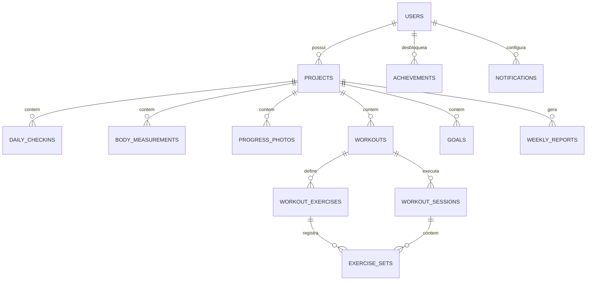

# BodyTrack — Diário de Transformação Corporal

Aplicativo para acompanhar recomposição corporal, musculação, perda de gordura e evolução física ao longo de vários meses — peso, medidas, fotos, treino, alimentação, água, sono e consistência, tudo em um só lugar, mostrado como uma linha do tempo de evolução em vez de "só o número da balança".

Este documento cobre a **Etapa 1 e 2** do desenvolvimento: arquitetura, stack, estrutura de pastas e modelagem do banco de dados. As etapas seguintes (API, autenticação, dashboard, check-in, treino, fotos, gráficos, relatórios, PWA, testes, deploy) estão descritas no plano ao final deste arquivo e serão implementadas uma de cada vez.

## 1. Arquitetura

O projeto é um **monorepo com dois serviços independentes**, comunicando-se por uma API REST versionada:

```
bodytrack/
├── backend/     # API (FastAPI + PostgreSQL)
└── frontend/    # SPA/PWA (React + TypeScript)
```

Por que separar em dois serviços (e não um app monolítico tipo Flask com templates)?

- O app é **mobile-first e precisa funcionar como PWA instalável**, com suporte a uso offline — isso pede um frontend que rode como aplicação client-side, não páginas renderizadas no servidor.
- Separar backend e frontend é o que permite, no futuro, reaproveitar a **mesma API** para um app mobile nativo, sem reescrever a lógica de negócio.
- Cada camada escala e é testada de forma independente.

### 1.1 Arquitetura do backend (em camadas)

```
backend/app/
├── main.py            # ponto de entrada FastAPI
├── core/              # configuração, segurança (JWT/hash), settings
├── db/                # engine, sessão, base declarativa
├── models/            # entidades SQLAlchemy (1 arquivo por domínio)
├── schemas/           # contratos Pydantic (entrada/saída da API)
├── api/v1/endpoints/  # rotas HTTP, um arquivo por domínio
├── services/          # regras de negócio (cálculo de volume, streak, insights...)
├── repositories/       # acesso a dados isolado do SQLAlchemy "cru"
└── tests/
```

A regra de dependência é sempre **api → services → repositories → models**. Os endpoints não conversam direto com o banco: eles chamam um `service`, que aplica regras de negócio (ex.: "não deixar cadastrar dois check-ins no mesmo dia", "calcular consistência da semana") e delega a persistência a um `repository`. Isso é o que separa "lógica do produto" de "detalhe de banco de dados" e é o que torna o código testável sem precisar de um Postgres real rodando (testes de service usam repositórios fake).

### 1.2 Arquitetura do frontend

```
frontend/src/
├── components/   # componentes de UI reutilizáveis (layout, charts, ui)
├── pages/        # uma página por rota (Início, Hoje, Treino, Evolução, Perfil)
├── hooks/        # hooks reutilizáveis (ex.: useCheckinStreak)
├── services/     # cliente HTTP (api.ts) + um módulo por domínio
├── contexts/     # estado global leve (autenticação)
├── types/        # tipos TypeScript espelhando os modelos do backend
└── utils/        # formatação de data, cálculo de IMC, etc.
```

Navegação: barra inferior (Início / Hoje / Treino / Evolução / Perfil) no celular, sidebar no desktop — o mesmo `AppLayout` decide qual mostrar via breakpoint CSS, sem duplicar rotas.

### 1.3 Por que isso escala para "produto multiusuário" no futuro

Toda entidade de dado pessoal (check-in, medida, foto, treino, meta) pertence a um `Project`, que pertence a um `User`. Não existe nenhuma tabela "global" compartilhada entre usuários. Isso significa que transformar o app de uso pessoal em produto para outras pessoas não exige remodelar o banco — só remover a suposição implícita de "existe um usuário só" em alguma tela de admin, se houver. A autenticação (Etapa 4) e o controle de acesso já nascem multiusuário: todo endpoint filtra por `current_user.id`.

## 2. Stack escolhida

| Camada | Escolha | Por quê |
|---|---|---|
| Backend | Python + FastAPI | Tipagem forte com Pydantic, documentação OpenAPI automática (`/docs`), assíncrono quando necessário, curva de aprendizado baixa para manutenção solo |
| Banco | PostgreSQL | Relacional, maduro, suporta bem o modelo relacional deste app (muitas FKs), fácil de rodar em qualquer provedor gerenciado no futuro |
| ORM/Migrations | SQLAlchemy 2.0 + Alembic | Tipagem com `Mapped[...]`, migrations versionadas e auditáveis |
| Auth | JWT (access + refresh) | Sem estado no servidor, funciona bem com SPA/PWA e futuramente com app mobile |
| Frontend | React + TypeScript + Vite | Ecossistema maduro, Vite dá build/HMR rápidos, TS pega erros antes de produção |
| Estilo | Tailwind CSS | Consistência visual rápida, tema escuro por padrão configurado via tokens de cor |
| Gráficos | Recharts | Componentes React nativos, suficiente para os ~9 gráficos pedidos sem exagero de bundle |
| Dados remotos | TanStack Query | Cache, retry e revalidação de requisições sem reinventar isso na mão |
| Formulários | react-hook-form + zod | Validação tipada no cliente, espelhando as validações do Pydantic no servidor |
| PWA | vite-plugin-pwa | Manifest + service worker gerados a partir de uma config, instalável no celular |
| Fotos | Disco local (dev) → object storage (produção) | `services/storage_service.py` abstrai o backend de armazenamento; trocar para S3/R2 não muda a tabela `progress_photos` nem a API |

Tudo isso é software livre, sem custo de licença, e amplamente documentado — importante para manutenção de longo prazo por uma pessoa só.

## 3. Modelagem do banco de dados

### 3.1 Entidades e decisões de design

- **IDs são UUID**, não inteiros autoincrementais. Um registro criado offline no celular já nasce com um identificador globalmente único, sem depender do servidor — pré-requisito para a sincronização entre dispositivos mencionada no briefing (item 21).
- Todo modelo tem `created_at`/`updated_at` — necessário para resolver conflitos de sincronização offline e para auditoria.
- `User → Project → (Checkin, Measurement, Photo, Workout, Goal, WeeklyReport)`: isolamento de dados por usuário é estrutural, não uma checagem manual espalhada pelo código.
- `daily_checkins` e `body_measurements` têm uma constraint `UNIQUE(project_id, date)` — um único registro por dia, o que simplifica (e torna confiável) todo cálculo de streak/consistência.
- O módulo de treino é modelado em **4 tabelas** porque "modelo de treino" e "execução real do treino" são conceitos diferentes:
  - `workouts` — o template (ex.: "Treino A")
  - `workout_exercises` — um exercício dentro do template, com meta planejada
  - `workout_sessions` — uma execução real, em uma data
  - `exercise_sets` — cada série de fato realizada (carga e repetições reais)

  Essa separação é o que permite comparar "última sessão 55kg×8" com "sessão atual 60kg×8" e montar o gráfico de evolução de carga sem perder o histórico quando o usuário edita a rotina.
- `progress_photos` guarda apenas o caminho do arquivo, nunca o binário — o acesso é sempre mediado por um endpoint autenticado que confere o dono da foto (ver seção de segurança).
- `weekly_reports` guarda um **snapshot já calculado** (JSON) em vez de recalcular tudo sob demanda: o relatório da semana 4 não muda retroativamente se um registro antigo for editado depois.

### 3.2 Diagrama de entidades



### 3.3 Tabela de entidades (resumo)

| Tabela | Descrição |
|---|---|
| `users` | conta do usuário, credenciais, altura, unidades preferidas |
| `projects` | um ciclo de transformação (ex.: "16 semanas"), com data inicial/final |
| `daily_checkins` | 1 registro por dia: peso, água, sono, passos, energia, humor, alimentação simples |
| `body_measurements` | medidas corporais opcionais (cintura, abdômen, braços, etc.) |
| `progress_photos` | fotos de frente/lado/costas, privadas por padrão |
| `workouts` / `workout_exercises` | templates de treino e seus exercícios planejados |
| `workout_sessions` / `exercise_sets` | execuções reais e séries de fato realizadas |
| `goals` | metas definidas pelo usuário (nunca sugeridas como promessa) |
| `achievements` | conquistas simples, sem competição entre usuários |
| `notifications` | preferências de lembretes (check-in, água, fotos, treino) |
| `weekly_reports` | resumo semanal calculado e congelado |

Os arquivos completos, com todos os campos e comentários de design, estão em `backend/app/models/`.

## 4. Segurança e privacidade (decisões já tomadas na modelagem)

- Toda tabela sensível referencia `project_id`/`user_id` com `ondelete="CASCADE"` — excluir um projeto ou conta remove os dados dependentes, sem deixar registros órfãos.
- Senhas nunca são armazenadas em texto puro — `hashed_password` usa `passlib`/bcrypt (implementado na Etapa 4).
- Fotos são privadas por padrão (`is_private=True`) e nunca expostas por URL pública direta.
- Nenhum dado é usado para treinar modelos de IA.
- Segredos (chave JWT, URL do banco) vêm de variáveis de ambiente (`.env`, nunca commitado — ver `.env.example`).

## 5. Como rodar (ambiente de desenvolvimento)

### Backend

```bash
cd backend
python3 -m venv .venv && source .venv/bin/activate
pip install -r requirements.txt
cp .env.example .env          # ajuste SECRET_KEY e DATABASE_URL se necessário

# subir só o Postgres via docker (ou aponte DATABASE_URL para um Postgres local)
docker compose up -d db

# a migration inicial já está versionada em alembic/versions/ — só aplicar:
alembic upgrade head

uvicorn app.main:app --reload
# API em http://localhost:8000 — docs interativas em http://localhost:8000/docs
```

Se algum dia mudar um `model` (novo campo, nova tabela), gere uma migration nova em vez de editar a existente:

```bash
alembic revision --autogenerate -m "descreva a mudança"
alembic upgrade head
```

### Frontend

```bash
cd frontend
npm install
cp .env.example .env
npm run dev
# app em http://localhost:5173
```

### Tudo junto via Docker Compose

```bash
docker compose up --build
```

## 6. Etapas implementadas

Cada etapa foi construída, testada e só então a seguinte foi iniciada, conforme o método pedido. Esta seção documenta o que existe hoje em cada uma.

### Etapa 3 — Backend/API (schemas + CRUD de Project)

- Camadas `schemas` (Pydantic), `repositories` (acesso a dados) e `services` (regras de negócio), com a dependência sempre em uma direção: `endpoint → service → repository → model`.
- CRUD completo de `Project` em `/api/v1/projects` (criar, listar, buscar, atualizar parcialmente, excluir).
- `app/api/deps.py::get_current_user_id` — nesta etapa ainda identificava o usuário via header `X-User-Id`, temporário até a Etapa 4 (a assinatura da função não mudou depois, então nenhum endpoint precisou ser tocado).
- `app/core/security.py` com hash de senha — criado já aqui porque a tabela `users` exige senha com hash desde o início.
- `scripts/seed_dev_user.py` — usuário de desenvolvimento para testar pelos `/docs` antes de existir login de verdade.
- Testes: criação/listagem de projeto, validação de datas, e **usuário B não consegue ler, editar nem excluir um projeto do usuário A** (sempre 404, nunca 403, para não revelar a existência do recurso a quem não é dono).

### Etapa 4 — Autenticação (JWT)

- `POST /api/v1/auth/register`, `POST /api/v1/auth/login`, `GET /api/v1/auth/me`.
- `app/core/security.py` reescrito: hash de senha com `bcrypt` diretamente (ver decisão técnica abaixo) e `create_access_token`/`decode_access_token` (JWT HS256, expiração configurável via `ACCESS_TOKEN_EXPIRE_MINUTES`).
- `app/api/deps.py::get_current_user_id` passou a decodificar o JWT de verdade (`Authorization: Bearer <token>`), mantendo a mesma assinatura usada por todo endpoint desde a Etapa 3 — nenhuma rota de projeto, check-in, treino etc. precisou mudar uma linha.
- **Decisão técnica**: a combinação `passlib` + `bcrypt` mais recente quebrava na inicialização (`bcrypt` mudou sua API interna e o `passlib` 1.7.4 não foi atualizado para acompanhar). Em vez de prender o projeto numa versão antiga de `bcrypt` só por causa disso, a chamada à biblioteca `bcrypt` passou a ser direta, com truncamento explícito em 72 bytes (limite da própria função hash do bcrypt) — menos uma camada de abstração e zero conflito de versão.
- Todo endpoint de domínio (projetos, check-ins, medidas, treinos, fotos, metas, relatórios) passou a chamar `get_project_or_404(db, project_id, user_id)` antes de qualquer operação — é o ponto único que garante isolamento entre usuários em todos os recursos aninhados sob um projeto.
- Frontend: `AuthContext` (login/registro/logout, validação do token salvo via `/auth/me` ao abrir o app), tela de login/registro (`LoginPage`), `RequireAuth` protegendo as rotas internas, interceptor do axios que desloga automaticamente em qualquer resposta `401`.

### Etapa 5 — Dashboard

- `GET /api/v1/projects/{id}/dashboard`: peso atual e variação desde o início, semana atual do ciclo, % concluído do projeto, streak de check-ins consecutivos, % de consistência da semana, contagem de treinos, IMC (quando há altura cadastrada).
- `app/services/dashboard_service.py` concentra os cálculos (`_compute_streak`, `_week_of_project`, `_percent_complete`, `_consistency_pct`) isolados do endpoint — testáveis sem subir a API.
- Frontend: `HomePage` consome o dashboard via TanStack Query, mostra os `StatCard`s e o gráfico de peso; se o usuário ainda não tem projeto, mostra o formulário de criação em vez de uma tela vazia.

### Etapa 6 — Check-in diário

- `POST/GET /api/v1/projects/{id}/checkins`, com **upsert por data**: salvar o check-in de um dia que já existe atualiza em vez de duplicar (constraint `UNIQUE(project_id, date)` no banco, regra de negócio em `checkin_service.py`).
- Campos: peso, água, sono (horas + qualidade), passos, treinou hoje, energia, humor, 4 flags simples de alimentação (sem contagem de calorias/macros — fora de escopo por decisão do briefing), observações livres.
- Frontend: `TodayPage`, pensada para o objetivo de "check-in em ~1 minuto" — campos numéricos diretos, seletores de escala 1–5 em vez de dropdowns, botões de "+250ml/+500ml/+1L" para água em vez de digitar.

### Etapa 7 — Treinos

- Modelo em 4 tabelas — `Workout` (template) → `WorkoutExercise` (exercício planejado) → `WorkoutSession` (execução real) → `ExerciseSet` (série de fato feita) — porque "o que o treino deveria ser" e "o que realmente aconteceu numa data" são conceitos diferentes, e essa separação é o que permite comparar a sessão atual com a anterior sem perder histórico quando a rotina é editada.
- `POST /api/v1/projects/{id}/workouts` (com exercícios aninhados), `POST .../sessions` (registrar uma execução com séries reais), `GET .../exercises/{id}/progress` (compara última sessão × sessão atual).
- `WorkoutSession.total_volume_kg` — propriedade calculada (`Σ reps × carga` de cada série), não uma coluna armazenada, porque é derivada e nunca deve dessincronizar dos dados reais.
- Frontend: `WorkoutPage` lista treinos, `NewWorkoutForm` cria templates, `SessionLogger` registra uma sessão (3 séries por exercício por padrão, com botão para adicionar mais).

### Etapa 8 — Medidas corporais

- `POST/GET /api/v1/projects/{id}/measurements`, mesmo padrão de upsert-por-data dos check-ins. Todos os campos são opcionais (cintura, abdômen, quadril, braços, coxas, peito, % gordura se o usuário souber por outro meio — o app nunca estima isso).
- `GET .../measurements/progress`: compara a primeira e a última medida registrada de cada campo, calculando a variação — é o que alimenta os cards "cintura: -4cm desde o início" na tela de Evolução.
- Frontend: `EvolutionPage` mostra os cards de progresso por medida.

### Etapa 9 — Fotos de progresso

- `app/services/storage_service.py` abstrai "onde o arquivo fica" atrás de `save_photo`/`read_photo`/`delete_photo_file` — hoje grava em disco local (`backend/storage/photos/`), e trocar para um object storage (S3/R2) em produção é reescrever só esse arquivo, sem tocar em endpoint/service/schema de fotos.
- `POST /api/v1/projects/{id}/photos` (upload multipart, ângulo frente/lado/costas, `is_private=True` por padrão), `GET .../photos/{id}/file` (serve o binário, mas só depois de confirmar que quem pediu é o dono — nunca por URL pública direta), `GET .../photos/compare` (duas fotos lado a lado por data).
- O schema de leitura (`PhotoRead`) nunca devolve o caminho do arquivo no disco para o cliente — só um `is_private` e os metadados; o binário só sai pelo endpoint autenticado acima.
- Frontend: `PhotoUploadForm` e grid de miniaturas (`PhotoThumbnail`) que buscam a imagem como blob autenticado (`getPhotoObjectUrl`), não como `` direto (que vazaria a URL sem token).

### Etapa 10 — Gráficos

- `GET /api/v1/projects/{id}/series?metric=...&period=...`: uma série temporal genérica (peso, cintura, água, sono, frequência de treino etc.) para qualquer métrica cadastrada, com período de 7/30/90 dias ou "projeto todo".
- Os gráficos seguem a diretriz de visualização de dados adotada no projeto: série única não usa legenda (o título já identifica a métrica), linhas finas de 2px com pontos visíveis para dados esparsos, grid e eixos discretos, tooltip ao passar o mouse — nada de cores decorativas ou 3D.
- `frontend/src/components/charts/MetricChart.tsx` é o componente genérico (linha ou barra) reutilizado em todas as ~9 métricas pedidas no briefing.

### Etapa 11 — Relatórios e exportação

- `POST /api/v1/projects/{id}/reports/generate`: calcula e **congela** um resumo semanal (`WeeklyReport.summary`, JSON) — o relatório da semana 4 não muda retroativamente se um check-in antigo for editado depois.
- `GET .../reports/export?format=csv|json`: exportação dos dados brutos do projeto (CSV em formato longo, um valor por linha, fácil de abrir em planilha).
- `GET .../reports/{id}/pdf`: PDF gerado com `reportlab` a partir do snapshot já calculado.
- Conquistas (`GET /api/v1/projects/{id}/achievements`): avaliadas sob demanda quando o endpoint é chamado (não por job em segundo plano) — catálogo simples em `achievement_service.py` (ex.: primeiro check-in, 7 dias de streak, primeiro PR de carga).
- Frontend: `ProfilePage` reúne exportação CSV/JSON, lista de metas com checkbox de "atingida" e lista de conquistas desbloqueadas.

### Etapa 12 — PWA e uso offline

- `vite-plugin-pwa` gera o manifest e o service worker (Workbox) que fazem o cache do "app shell" — depois da primeira visita, o app abre mesmo sem internet (a tela pode não ter dados novos, mas não fica em branco).
- Ícones reais do PWA (`frontend/public/icons/icon-192.png` e `icon-512.png`), necessários para o navegador oferecer "instalar aplicativo" no celular.
- **Fila offline de check-in** (`src/services/offlineQueue.ts` + `src/hooks/useOfflineSync.ts`): como o check-in diário é a ação mais sensível a conectividade (é o fluxo de "1 minuto por dia"), se o `POST` falhar por falta de rede — não por erro de validação, a distinção é feita checando se a resposta do axios tem `response` ou não — o check-in é salvo no `localStorage` do aparelho em vez de ser perdido, e reenviado automaticamente quando a conexão voltar (evento `online` do navegador + verificação a cada 30s como rede de segurança).
- `TodayPage` mostra "Check-in salvo" (verde) quando o envio foi direto ao servidor, ou um aviso âmbar explicando que ficou salvo no aparelho e será sincronizado quando a internet voltar.
- `AppLayout` (visível em toda tela autenticada, não só na de check-in) mostra um banner com a contagem de check-ins pendentes de sincronização, para a fila nunca ficar invisível ao usuário.
- Por que `localStorage` em vez de `IndexedDB` aqui: o volume é mínimo (alguns JSONs de poucas centenas de bytes cada). Se no futuro o app enfileirar fotos offline (arquivos grandes), aí sim isso migra para `IndexedDB`.

### Etapa 13 — Testes automatizados

Ver a seção **7. Testes automatizados** abaixo.

### Etapa 14 — Deploy

Ver a seção **8. Deploy em produção** abaixo.

## 7. Testes automatizados

```bash
cd backend
pytest -v
```

33 testes, todos rodando contra **SQLite em memória** (`tests/conftest.py`), sem precisar de um Postgres real — o que os torna rápidos o suficiente para rodar a cada alteração. Cobertura por domínio, sempre no mesmo padrão: CRUD básico + **um teste específico de que um usuário não acessa dado de outro usuário** (auth, projects, checkins, measurements, workouts, goals, dashboard/series, photos, reports, achievements têm esse teste; auth não precisa, por não ter dado "de projeto"). Destaques específicos:

- `test_workouts.py::test_log_session_and_compute_volume` — confere o valor exato do volume calculado (`Σ reps × carga`), não só que "algum número" voltou.
- `test_workouts.py::test_exercise_progress_compares_last_two_sessions` — a comparação "última sessão × atual" usada no gráfico de carga.
- `test_dashboard_and_series.py` — agregação do dashboard e que a série de peso volta ordenada por data, além de rejeitar uma métrica inválida.
- `test_photos.py` — upload, que a URL do arquivo nunca aparece no JSON de resposta, e isolamento entre usuários.

**Um bug real que os 33 testes acima não pegaram**, e como foi encontrado: rodando a suíte inteira, tudo passava — mas subir a API de verdade (`uvicorn app.main:app`, sem os testes) quebrava com `InvalidRequestError: ... failed to locate a name ('Notification')`. A causa: `User.notifications` referencia a classe `Notification` por **string** (necessário porque `notification.py` importa `user.py`, e `user.py` não pode importar `notification.py` de volta sem criar um import circular), e o SQLAlchemy só resolve essa string se a classe `Notification` já tiver sido importada em algum lugar do processo antes da primeira query. Os testes importam `app.db.base` (que importa todos os modelos) em `conftest.py`; um `uvicorn app.main:app` puro nunca tocava esse import, porque não existe nenhum endpoint de notificações ainda. **Correção**: `app/main.py` agora importa `app.db.base` explicitamente, com um comentário no próprio arquivo explicando por quê. Isso só foi descoberto porque, além dos testes automatizados, foi feito um teste de fumaça manual contra um processo real (ver próxima seção) — é a mesma razão pela qual "rodar testes" no plano deste projeto sempre incluiu subir a aplicação de verdade, não só confiar no verde do pytest.

## 8. Deploy em produção

O app foi validado ponta a ponta contra um Postgres real (não SQLite) rodando com o schema aplicado via **migration real do Alembic** (não `create_all`) — o mesmo caminho usado em produção — antes desta seção ser escrita, então o que está descrito aqui já foi exercitado, não é só teoria.

### 8.1 Opção recomendada: Docker Compose num VPS

Arquivos já prontos no repositório: `backend/Dockerfile`, `backend/entrypoint.sh`, `frontend/Dockerfile`, `frontend/nginx.conf`, `docker-compose.prod.yml`.

```bash
cp .env.example .env
# edite .env: POSTGRES_PASSWORD, SECRET_KEY (gere com
# python -c "import secrets; print(secrets.token_urlsafe(64))"),
# CORS_ORIGINS com o domínio real entre aspas, ex: ["https://meudominio.com"]

docker compose -f docker-compose.prod.yml up -d --build
```

O que essa stack faz, e por quê:

- **`backend/entrypoint.sh`** roda `alembic upgrade head` toda vez que o container da API sobe, antes de iniciar o servidor — é idempotente (não faz nada se o schema já estiver em dia), então funciona tanto no primeiro deploy quanto em todos os seguintes, sem passo manual.
- O backend sobe com múltiplos workers uvicorn (`WEB_CONCURRENCY`, padrão 2) e roda como usuário sem privilégios dentro do container (não root) — únicos ajustes de produção que não faziam sentido no Dockerfile de desenvolvimento.
- O frontend é compilado (`npm run build`) dentro de uma imagem de build e servido por **nginx**, não pelo servidor de desenvolvimento do Vite — a imagem final não contém Node nem `node_modules`.
- O nginx do frontend também faz **proxy reverso de `/api/` para o backend**, então front e back ficam no mesmo domínio: elimina a necessidade de configurar CORS entre domínios diferentes e permite `VITE_API_URL=/api/v1` (caminho relativo, decidido em tempo de build — ver comentário no `frontend/Dockerfile` sobre por que isso não pode ser uma variável de ambiente lida em runtime).
- `sw.js` e `manifest.webmanifest` são servidos com `Cache-Control: no-cache` — sem isso, o service worker de um deploy antigo poderia ficar preso no navegador do usuário e nunca buscar a versão nova do app.
- O volume `photos` persiste as fotos enviadas entre reinícios/atualizações do container da API; o Postgres não expõe a porta 5432 para fora da rede interna do Compose.

Isso sobe a aplicação em HTTP puro, na porta 80. Para HTTPS (obrigatório antes de aceitar cadastro de usuários de verdade — o briefing original já pede isso), coloque na frente um proxy com certificado automático, por exemplo **Caddy** (`Caddyfile` de 3 linhas: `meudominio.com { reverse_proxy frontend:80 }`) ou **Traefik**; qualquer VPS com Docker (Hetzner, DigitalOcean, Contabo etc.) serve.

### 8.2 Alternativa: PaaS gerenciado (sem administrar servidor)

Quando não se quer administrar um VPS:

- **Backend**: Railway, Render ou Fly.io — todos leem o `backend/Dockerfile` diretamente (build automático a partir de um Dockerfile é suportado pelos três) e oferecem um Postgres gerenciado com um clique. Configurar as mesmas variáveis de `backend/.env.example` no painel do serviço (`DATABASE_URL` passa a apontar para o Postgres gerenciado pela própria plataforma).
- **Frontend**: Vercel ou Netlify — apontar para a pasta `frontend/`, comando de build `npm run build`, diretório de saída `dist/`, variável de build `VITE_API_URL` com a URL pública do backend implantado no passo anterior. Nesse caminho (domínios diferentes), `CORS_ORIGINS` no backend precisa ser a URL exata do frontend publicado.
- Vantagem sobre o Compose: deploy automático a cada push, sem gerenciar SO/atualizações de segurança do servidor. Desvantagem: custo por serviço gerenciado, e as fotos não podem continuar em disco local (a maioria desses PaaS tem sistema de arquivos efêmero) — nesse caminho, trocar `STORAGE_BACKEND` para um object storage (S3/R2/Spaces) é obrigatório; é justamente por isso que `storage_service.py` já nasceu como uma abstração desde a Etapa 9, para essa troca não exigir mudar API nem banco.

### 8.3 Checklist antes de aceitar usuários reais

- [ ] `SECRET_KEY` trocado por um valor gerado (nunca o do `.env.example`)
- [ ] `DEBUG=false` / `ENV=production`
- [ ] `CORS_ORIGINS` restrito ao(s) domínio(s) reais, nunca `["*"]`
- [ ] HTTPS na frente da aplicação (obrigatório para PWA instalável em muitos navegadores, e para não trafegar senha/token em texto claro)
- [ ] Backup automático do volume/instância do Postgres (o app nunca exclui um projeto sem confirmação explícita do usuário, mas isso não substitui backup de banco)
- [ ] `STORAGE_BACKEND` avaliado conforme a opção de hospedagem escolhida (disco local exige volume persistente; PaaS sem disco persistente exige object storage)

## 9. Status do projeto

- [x] Etapa 1 — Arquitetura, stack, estrutura de pastas
- [x] Etapa 2 — Modelagem do banco de dados (13 tabelas)
- [x] Etapa 3 — Backend/API: CRUD de Project em camadas
- [x] Etapa 4 — Autenticação (JWT)
- [x] Etapa 5 — Dashboard
- [x] Etapa 6 — Check-in diário
- [x] Etapa 7 — Treinos
- [x] Etapa 8 — Medidas corporais
- [x] Etapa 9 — Fotos de progresso
- [x] Etapa 10 — Gráficos
- [x] Etapa 11 — Relatórios e exportação
- [x] Etapa 12 — PWA e uso offline
- [x] Etapa 13 — Testes automatizados (33 testes, cobrindo CRUD + isolamento entre usuários em todo domínio)
- [x] Etapa 14 — Deploy (Dockerfiles de produção, Alembic com migration inicial versionada, docker-compose.prod.yml, documentação de PaaS como alternativa)

Todas as 14 etapas do plano original foram implementadas, testadas e documentadas. Áreas do briefing original tratadas como **fora do escopo desta primeira entrega**, por opção deliberada (não por esquecimento): estimativa de % de gordura corporal por IA a partir de fotos (explicitamente proibida pelo próprio briefing), simulação preditiva de resultados futuros (o app registra e mostra dados reais, nunca promete um número), e app mobile nativo (a base já é uma PWA instalável, que cobre a mesma necessidade sem duplicar código).

## 10. Avisos importantes (produto)

Este app não faz diagnóstico médico, não interpreta exames, não prescreve dietas ou medicamentos e não substitui acompanhamento de nutricionista, médico ou profissional de educação física. Metas são definidas pelo usuário e tratadas como tal — o sistema nunca promete um resultado ("você vai perder X kg"), apenas registra e apresenta a evolução real dos dados inseridos.
